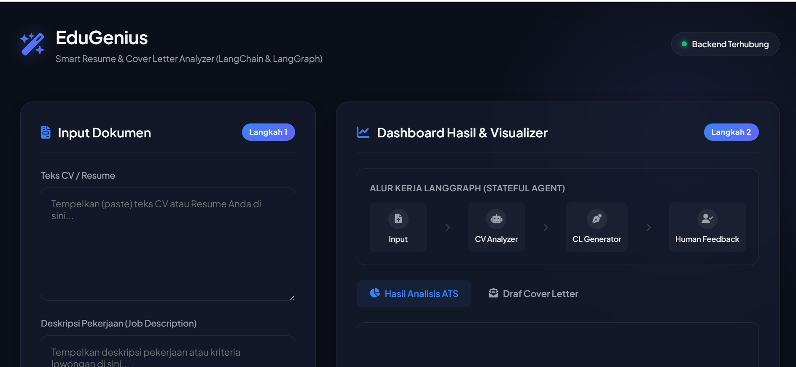
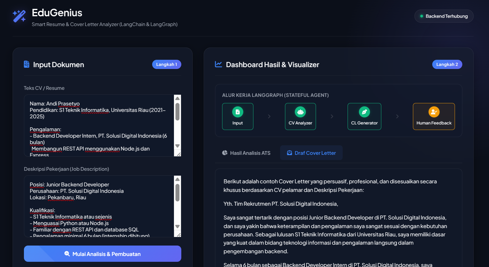
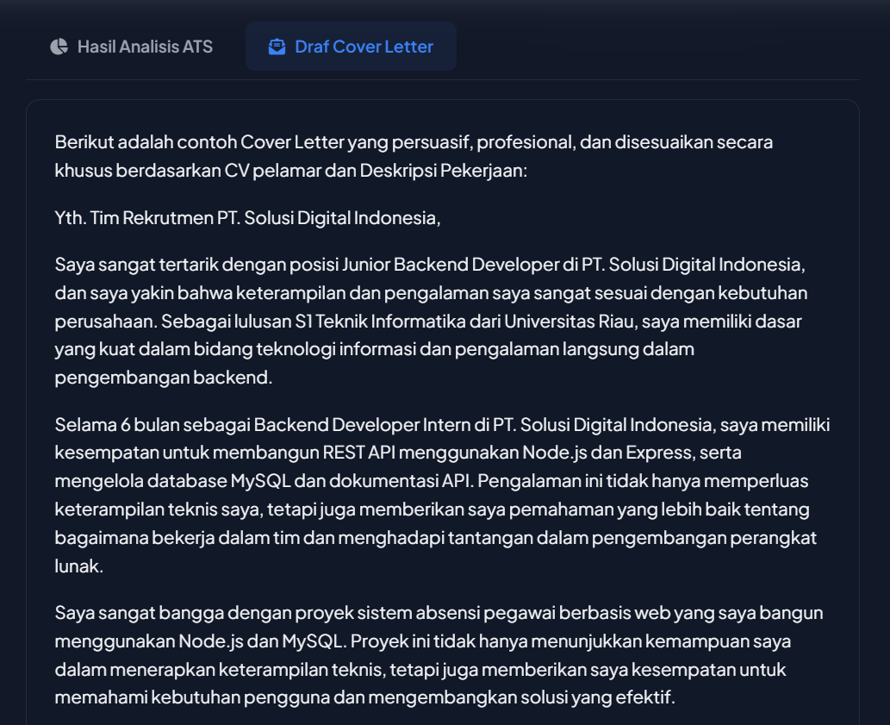
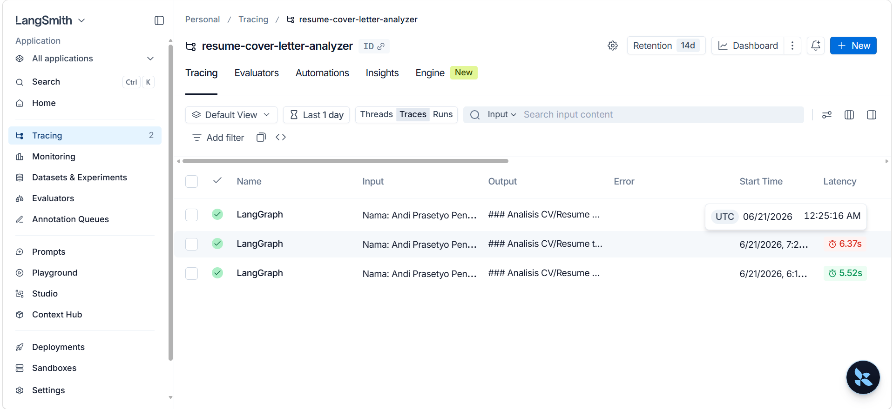

<div align="center">

# ✨ EduGenius
### Smart Resume & Cover Letter Analyzer

**Sistem Analisis CV dan Generator Cover Letter berbasis AI dengan Stateful Multi-Agent Workflow**

[](https://python.org)
[](https://fastapi.tiangolo.com)
[](https://langchain.com)
[](https://langchain-ai.github.io/langgraph/)
[](https://smith.langchain.com)

*Proyek UAS Mata Kuliah Natural Language Processing (NLP)*

---

</div>

## 📌 Deskripsi Proyek

**EduGenius** adalah aplikasi web berbasis AI yang membantu pelamar kerja menganalisis kesesuaian CV mereka dengan lowongan pekerjaan (Job Description) secara otomatis dan cerdas. Sistem ini dibangun menggunakan arsitektur **Stateful Multi-Agent Workflow** dengan memanfaatkan tiga library NLP utama: **LangChain**, **LangGraph**, dan **LangSmith**.

### 🎯 Fitur Utama

| Fitur | Deskripsi |
|-------|-----------|
| 🔍 **Analisis ATS Cerdas** | Menghitung skor kecocokan CV dengan Job Description (0–100%), mengidentifikasi kelebihan, kesenjangan skill, dan rekomendasi perbaikan |
| ✍️ **Generator Cover Letter** | Membuat surat lamaran profesional dan *tailored* secara otomatis berdasarkan CV dan Job Description |
| 🔄 **Human-in-the-Loop** | Alur kerja dapat dijeda agar pengguna bisa merevisi hasil Cover Letter berkali-kali sebelum disetujui |
| 📊 **LangGraph Visualizer** | Menampilkan status node aktif di alur kerja LangGraph secara real-time pada UI |
| 🔭 **LangSmith Tracing** | Monitoring lengkap untuk token usage, latensi, dan jalur berpikir agen di setiap eksekusi |

---

## 🖼️ Screenshot Aplikasi

> **Petunjuk**: Tambahkan screenshot aplikasi kamu di folder `docs/screenshots/` lalu update path di bawah ini.

### Halaman Utama — Input Dokumen


### Hasil Analisis ATS


### Draf Cover Letter & Human-in-the-Loop


### Dashboard LangSmith Tracing


---

## 🏛️ Arsitektur Sistem

Sistem ini mengimplementasikan pola **Stateful Multi-Agent Graph** menggunakan LangGraph. Setiap langkah dieksekusi sebagai **Node** dalam sebuah **State Machine Graph**:

```
┌─────────┐     ┌─────────────┐     ┌─────────────┐     ┌──────────────┐
│  START  │────▶│  analyze_cv │────▶│ generate_cl │────▶│ human_review │
└─────────┘     └─────────────┘     └─────────────┘     └──────┬───────┘
                                            ▲                   │
                                            │    [ada revisi]   │ decide_next_step()
                                            └───────────────────┤
                                                                 │ [disetujui]
                                                                 ▼
                                                              ┌─────┐
                                                              │ END │
                                                              └─────┘
```

### Alur Kerja Detail:
1. **`START`** → Menerima input CV dan Job Description dari UI
2. **`analyze_cv`** → LLM menganalisis kecocokan ATS dan menghasilkan laporan terstruktur (Markdown)
3. **`generate_cl`** → LLM membuat draf Cover Letter berbasis hasil analisis
4. **`human_review`** → ⏸️ **Graph di-interrupt** sebelum node ini. State disimpan ke checkpoint memory. Sistem menunggu feedback user dari UI
5. **`decide_next_step`** (Conditional Edge):
   - Jika ada **instruksi revisi** → Loop kembali ke `generate_cl`
   - Jika user **Approve** → Alur selesai (`END`)

---

## 🛠️ Stack Teknologi

### Backend
| Library | Versi | Peran |
|---------|-------|-------|
| **Python** | 3.10+ | Bahasa pemrograman utama |
| **FastAPI** | 0.111 | Framework API REST |
| **LangChain** | 0.2.x | Prompt template, LLM wrapper, dan LCEL (Chain) |
| **LangGraph** | 0.2.x | Stateful multi-agent workflow (State Machine Graph) |
| **LangSmith** | 0.1.x | Monitoring, tracing, dan observabilitas LLM |
| **Groq** | - | LLM provider (llama-3.3-70b-versatile) gratis & cepat |
| **Uvicorn** | 0.30 | ASGI server untuk menjalankan FastAPI |

### Frontend
| Teknologi | Peran |
|-----------|-------|
| **HTML5 + CSS3** | Struktur dan styling (Dark Glassmorphism Theme) |
| **Vanilla JavaScript** | Logika interaksi dan Fetch API |
| **Marked.js** | Render output Markdown dari LLM ke HTML |
| **Font Awesome** | Icon set |
| **Google Fonts** | Typography (Plus Jakarta Sans) |

---

## 📁 Struktur Direktori

```
uas-nlp-project/
│
├── 📄 .env.example          # Template konfigurasi API keys
├── 📄 .gitignore            # File yang dikecualikan dari git
├── 📄 README.md             # Dokumentasi proyek ini
│
├── 📂 backend/
│   ├── 📄 app.py            # Server FastAPI & endpoint API (/api/analyze, /api/feedback)
│   ├── 📄 config.py         # Loader variabel lingkungan (.env)
│   ├── 📄 requirements.txt  # Daftar dependensi Python
│   │
│   └── 📂 agents/
│       ├── 📄 __init__.py
│       ├── 📄 state.py      # Skema State LangGraph (TypedDict)
│       └── 📄 graph.py      # Konstruksi alur multi-agent & interrupt config
│
└── 📂 frontend/
    ├── 📄 index.html        # Halaman utama dashboard
    ├── 📄 styles.css        # Styling (Dark Glassmorphism + animasi)
    └── 📄 app.js            # Logika frontend & komunikasi API
```

---

## ⚙️ Cara Menjalankan Program

### Prasyarat

Sebelum memulai, pastikan kamu sudah memiliki:
- ✅ **Python 3.10+** — [Download Python](https://python.org/downloads)
- ✅ **Git** — [Download Git](https://git-scm.com/downloads)
- ✅ **Groq API Key** (gratis) — [Daftar di console.groq.com](https://console.groq.com)
- ✅ **LangSmith API Key** (gratis, opsional) — [Daftar di smith.langchain.com](https://smith.langchain.com)

---

### Langkah 1 — Clone Repository

```bash
git clone https://github.com/USERNAME/REPO-NAME.git
cd REPO-NAME
```

---

### Langkah 2 — Konfigurasi API Keys

Buat file `.env` di folder **root project** (sejajar dengan folder `backend/`):

```bash
# Windows (PowerShell)
copy .env.example .env
```

Lalu buka file `.env` dan isi dengan API key kamu:

```env
# Groq API Key — dapatkan gratis di https://console.groq.com
GROQ_API_KEY=gsk_xxxxxxxxxxxxxxxxxxxxxxxxxxxxxxxxxxxxxxxx

# LangSmith (opsional, untuk monitoring)
LANGCHAIN_TRACING_V2=true
LANGCHAIN_API_KEY=lsv2_pt_xxxxxxxxxxxxxxxxxxxxxxxxxxxxxxxx
LANGCHAIN_PROJECT=resume-cover-letter-analyzer
```

---

### Langkah 3 — Setup Virtual Environment & Install Dependensi

Buka **PowerShell** atau **Terminal**, lalu jalankan:

```powershell
# Masuk ke folder backend
cd backend

# Buat virtual environment baru
python -m venv venv

# Aktifkan virtual environment (Windows)
.\venv\Scripts\activate

# Install semua dependensi
pip install -r requirements.txt
```

---

### Langkah 4 — Jalankan Server

```powershell
# Masih di dalam folder backend dengan venv aktif
python app.py
```

Jika berhasil, kamu akan melihat output:
```
GROQ_API_KEY berhasil dimuat.
INFO:     Uvicorn running on http://127.0.0.1:8000 (Press CTRL+C to quit)
INFO:     Started reloader process using WatchFiles
```

---

### Langkah 5 — Akses Aplikasi

Buka browser dan navigasi ke:

> 🌐 **[http://127.0.0.1:8000](http://127.0.0.1:8000)**

Frontend dashboard akan tampil secara otomatis (sudah di-serve oleh FastAPI).

---

### Cara Penggunaan Aplikasi

1. **Tempelkan teks CV/Resume** kamu di kolom kiri atas
2. **Tempelkan teks Job Description** di kolom kiri bawah
3. Klik tombol **"Mulai Analisis & Pembuatan"**
4. Tunggu proses analisis (beberapa detik) — perhatikan **LangGraph Visualizer** yang menunjukkan node aktif
5. Lihat **Hasil Analisis ATS** di tab kanan atas
6. Lihat **Draf Cover Letter** di tab kanan bawah
7. Gunakan panel **Human-in-the-Loop** untuk:
   - ✏️ Ketik instruksi revisi (contoh: *"Tolong buat nada tulisan lebih formal"*)
   - ✅ Klik **Setujui & Selesai** jika sudah puas dengan hasilnya

---

## 🔭 Monitoring dengan LangSmith

Jika `LANGCHAIN_TRACING_V2=true` dan `LANGCHAIN_API_KEY` sudah diisi, setiap eksekusi LLM akan otomatis tercatat di dashboard LangSmith.

Buka **[smith.langchain.com](https://smith.langchain.com)** → pilih project **`resume-cover-letter-analyzer`** untuk melihat:
- 📈 **Trace lengkap** setiap pemanggilan LLM
- 💰 **Token usage** (input & output tokens)
- ⏱️ **Latensi** per node
- 🧠 **Input & Output** setiap agen

---

## 📚 Bukti Penggunaan Library Wajib

### 1. LangChain — `backend/agents/graph.py`
```python
from langchain_groq import ChatGroq
from langchain_core.prompts import ChatPromptTemplate

# Prompt template terstruktur
analysis_prompt = ChatPromptTemplate.from_messages([...])

# LangChain Expression Language (LCEL) — pipe operator
chain = analysis_prompt | llm
response = chain.invoke({"cv": ..., "job_description": ...})
```

### 2. LangGraph — `backend/agents/graph.py`
```python
from langgraph.graph import StateGraph, START, END
from langgraph.checkpoint.memory import MemorySaver

workflow = StateGraph(AgentState)
workflow.add_node("analyze_cv", analyze_cv_node)
workflow.add_node("generate_cl", generate_cover_letter_node)
workflow.add_node("human_review", human_review_node)
workflow.add_conditional_edges("human_review", decide_next_step, {...})

# Compile dengan interrupt & checkpoint
app_graph = workflow.compile(
    checkpointer=MemorySaver(),
    interrupt_before=["human_review"]   # ← Human-in-the-Loop!
)
```

### 3. LangSmith — `.env` (zero-code integration)
```env
LANGCHAIN_TRACING_V2=true        # ← Aktifkan otomatis
LANGCHAIN_API_KEY=lsv2_pt_xxx    # ← API key LangSmith
LANGCHAIN_PROJECT=resume-...     # ← Nama project di dashboard
```

---

## 👤 Informasi Pengembang

| | |
|--|--|
| **Nama** | *Meisyah Ababil* |
| **NIM** | *233510092* |
| **Mata Kuliah** | Natural Language Processing (NLP) |
| **Semester** | *6 (enam)* |
| **Dosen Pengampu** | *Prof.Dr. Arbi Haza Nasution,B.IT (Hons), M.IT* |

---

<div align="center">

**⭐ Jika proyek ini bagus, jangan lupa beri bintang di GitHub yaaa semuanyaaa! ⭐**

*Dibuat dengan ❤️ untuk UAS NLP inii, bismillahhh*

</div>
